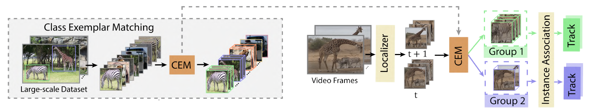

# Tracking Every Thing in the Wild [ECCV2022]

This is the offical implementation of paper [Tracking Every Thing in the Wild](https://arxiv.org/abs/2207.12978).

Our project website contains more information: [vis.xyz/pub/tet](https://www.vis.xyz/pub/tet/).


## Abstract

Current multi-category Multiple Object Tracking (MOT) metrics use class labels to group tracking results for per-class evaluation. Similarly, MOT methods typically only associate objects with the same class predictions. 
These two prevalent strategies in MOT implicitly assume that the classification performance is near-perfect. 
However, this is far from the case in recent large-scale MOT datasets, which contain large numbers of classes with many rare or semantically similar categories. Therefore, the resulting inaccurate classification leads to sub-optimal tracking and inadequate benchmarking of trackers.
We address these issues by disentangling classification from tracking.
We introduce a new metric, Track Every Thing Accuracy (TETA), breaking tracking measurement into three sub-factors: localization, association, and classification, allowing comprehensive benchmarking of tracking performance even under inaccurate classification. TETA also deals with the challenging incomplete annotation problem in large-scale tracking datasets. We further introduce a Track Every Thing tracker (TETer), that performs association using Class Exemplar Matching (CEM). Our experiments show that TETA evaluates trackers more comprehensively, and TETer achieves significant improvements on the challenging large-scale datasets BDD100K and TAO compared to the state-of-the-art.

## TETA
[TETA](teta/README.md) builds upon the HOTA metric, while extending it to better deal with
multiple categories and incomplete annotations. TETA evaluate trackers based on a novel local cluster design. TETA consists of three parts: a
localization score, an association score, and a classification score, which enable
us to evaluate the different aspects of each tracker properly.


## TETer
TETer follows an Associate-Every-Thing (AET) strategy.
Instead of only associating objects in the same class, we associate every object in neighboring frames. 
We introduce Class Exemplar Matching (CEM), where the learned class exemplars incorporate valuable class information in a soft manner.
In this way, we effectively exploit semantic supervision on large-scale detection datasets while not relying on the often incorrect classification output.



## Main results
Our method outperforms the states of the art on BDD100K, and TAO benchmarks.

### BDD100K val set

| Method                                              | backbone  | pretrain    | mMOTA | mIDF1 | TETA | LocA | AssocA | ClsA | config                            | model                                                                                              |
|-----------------------------------------------------|-----------|-------------|-------|-------|------|------|--------|------|-----------------------------------|----------------------------------------------------------------------------------------------------|
| [QDTrack(CVPR21)](https://arxiv.org/abs/2006.06664) | ResNet-50 | ImageNet-1K | 36.6  | 51.6  | 47.8 | 45.9 | 48.5   | 49.2 | -                                 | -                                                                                                  |
| TETer (Ours)                                        | ResNet-50 | ImageNet-1K | 39.1  | 53.3  | 50.8 | 47.2 | 52.9   | 52.4 | [cfg](configs/bdd100k/cem_bdd.py) | [google drive](https://drive.google.com/file/d/1InuFZkOtIsYZLCe0HFK74YK-_a0X1q6q/view?usp=sharing) |


### BDD100K test set

| Method                                              | backbone  | pretrain    | mMOTA | mIDF1 | TETA | LocA | AssocA | ClsA | config                            | model                                                                                              |
|-----------------------------------------------------|-----------|-------------|-------|-------|------|------|--------|------|-----------------------------------|----------------------------------------------------------------------------------------------------|
| [QDTrack(CVPR21)](https://arxiv.org/abs/2006.06664) | ResNet-50 | ImageNet-1K | 35.7  | 52.3  | 49.2 | 47.2 | 50.9   | 49.2 | -                                 | -                                                                                                  | 
| TETer (Ours)                                        | ResNet-50 | ImageNet-1K | 37.4  | 53.3  | 50.8 | 47.0 | 53.6   | 50.7 | [cfg](configs/bdd100k/cem_bdd.py) | [google drive](https://drive.google.com/file/d/1InuFZkOtIsYZLCe0HFK74YK-_a0X1q6q/view?usp=sharing) | 


### TAO val set

| Method                                              | backbone          | pretrain     | TETA | LocA | AssocA | ClsA | config                               | model                                                                                              | preds                                                                                                 |
|-----------------------------------------------------|-------------------|--------------|------|------|--------|------|--------------------------------------|----------------------------------------------------------------------------------------------------|-------------------------------------------------------------------------------------------------------|
| [QDTrack(CVPR21)](https://arxiv.org/abs/2006.06664) | ResNet-101        | ImageNet-1K  | 30.0 | 50.5 | 27.4   | 12.1 | -                                    | -                                                                                                  | -                                                                                                     |
| TETer (Ours)                                        | ResNet-101        | ImageNet-1K  | 33.3 | 51.6 | 35.0   | 13.2 | [cfg](configs/tao/cem_r101_lvis.py)  | [google drive](https://drive.google.com/file/d/17koyuCbnj42ioZRxZZ5DChmCoAaMwets/view?usp=sharing) | coming soon                                                                                           |
| TETer-HTC (Ours)                                    | ResNeXt-101-64x4d | ImageNet-1K  | 36.9 | 57.5 | 37.5   | 15.7 | -                                    | -                                                                                                  | -                                                                                                     |
| TETer-SwinT (Ours)                                  | SwinT             | ImageNet-1K  | 34.6 | 52.1 | 36.7   | 15.0 | [cfg](configs/tao/cem_swinT_lvis.py) | [google drive](https://drive.google.com/file/d/1UvMkH1xfCqNghiDCbb6jE_9yklYggmlM/view?usp=sharing) | coming soon                                                                                           |
| TETer-SwinS (Ours)                                  | SwinS             | ImageNet-1K  | 36.7 | 54.2 | 38.4   | 17.4 | [cfg](configs/tao/cem_swinS_lvis.py) | [google drive](https://drive.google.com/file/d/1jRjrj57PKi7fLKBgoq2Dt5SZJC4Nejip/view?usp=sharing) | coming soon                                                                                           |
| TETer-SwinB (Ours)                                  | SwinB             | ImageNet-22K | 38.8 | 55.6 | 40.1   | 20.8 | [cfg](configs/tao/cem_swinB_lvis.py) | [google drive](https://drive.google.com/file/d/11Y3Vv1gB4m0Vn7AKI5XW1TIsCOq30hKB/view?usp=sharing) | coming soon                                                                                           |
| TETer-SwinL (Ours)                                  | SwinL             | ImageNet-22K | 40.1 | 56.3 | 39.9   | 24.1 | [cfg](configs/tao/cem_swinL_lvis.py) | [google drive](https://drive.google.com/file/d/1J3z5pbF7trU3fDCVfizAPsmp3oV9NVj8/view?usp=sharing) | [google drive](https://drive.google.com/file/d/1ZXXV-hQOxC-luSQcH3ph1k1ETUe6rYKV/view?usp=share_link) |    

## Installation

Please refer to [INSTALL.md](docs/INSTALL.md) for installation instructions.


## Usages
Please refer to [GET_STARTED.md](docs/GET_STARTED.md) for dataset preparation and running instructions.


## Citation

```
@InProceedings{trackeverything,
  title = {Tracking Every Thing in the Wild},
  author = {Li, Siyuan and Danelljan, Martin and Ding, Henghui and Huang, Thomas E. and Yu, Fisher},
  booktitle = {Proceedings of the European Conference on Computer Vision (ECCV)},
  month = {Oct},
  year = {2022}
}
```
