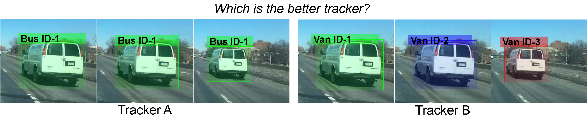
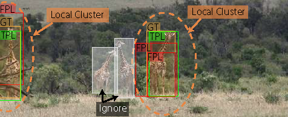

# Track Every Thing Accuracy
[Track Every Thing in the Wild](https://arxiv.org/abs/2207.12978) [ECCV 2022].

This is the official implementation of TETA metric describe in the paper. 



The proposed TETA metric disentangles classification performance from tracking.
Instead of using the predicted class labels to group per-class tracking results, we use location with the help of local cluster evaluation.
We treat each ground truth bounding box of the target class as the anchor of each cluster and group prediction results inside each cluster to evaluate the localization and association performance.
Our local clusters enable us to evaluate tracks even when the class prediction is wrong.



## Install
Install the TETA environment using pip.
```angular2html
pip install -r requirements.txt
```
Go to the root of the teta folder and quick install by
```
pip install -e .
```
## Support data format
Result format follows COCO-VID format. We describe the format in detail [here](./docs/TAO-format.txt)

## How to Run
Run on TAO.
```angular2html
python scripts/run_tao.py --METRICS TETA --TRACKERS_TO_EVAL TETer --GT_FOLDER ${GT_JSON_PATH}.json --TRACKER_SUB_FOLDER ${RESULT_JSON_PATH}.json   
```
Run  on BDD100K.
```angular2html
python scripts/run_coco.py --METRICS TETA --TRACKERS_TO_EVAL TETer --GT_FOLDER ${GT_JSON_PATH}.json --TRACKER_SUB_FOLDER ${RESULT_JSON_PATH}.json   
```

## Citation

```
@InProceedings{trackeverything,
  title = {Tracking Every Thing in the Wild},
  author = {Li, Siyuan and Danelljan, Martin and Ding, Henghui and Huang, Thomas E. and Yu, Fisher},
  booktitle = {Proceedings of the European Conference on Computer Vision (ECCV)},
  month = {Oct},
  year = {2022}
}
```